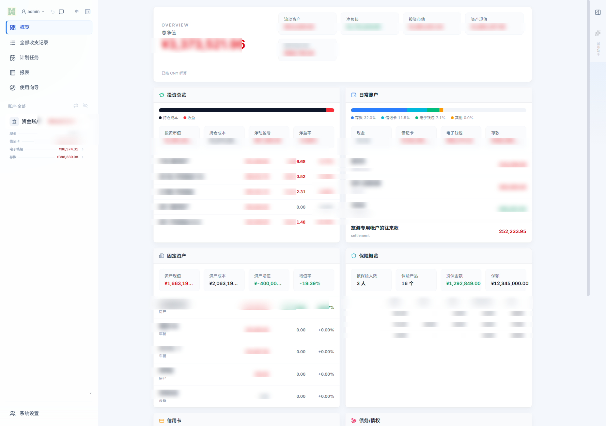
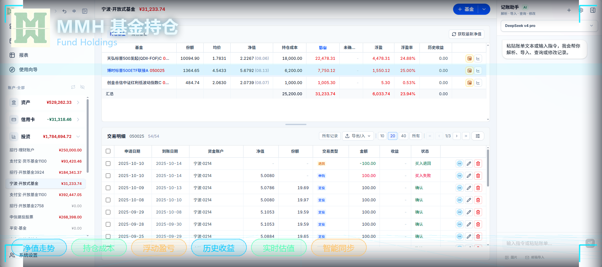
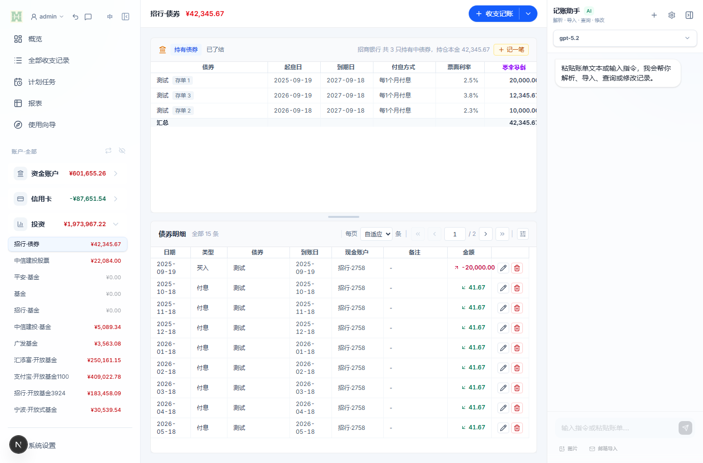
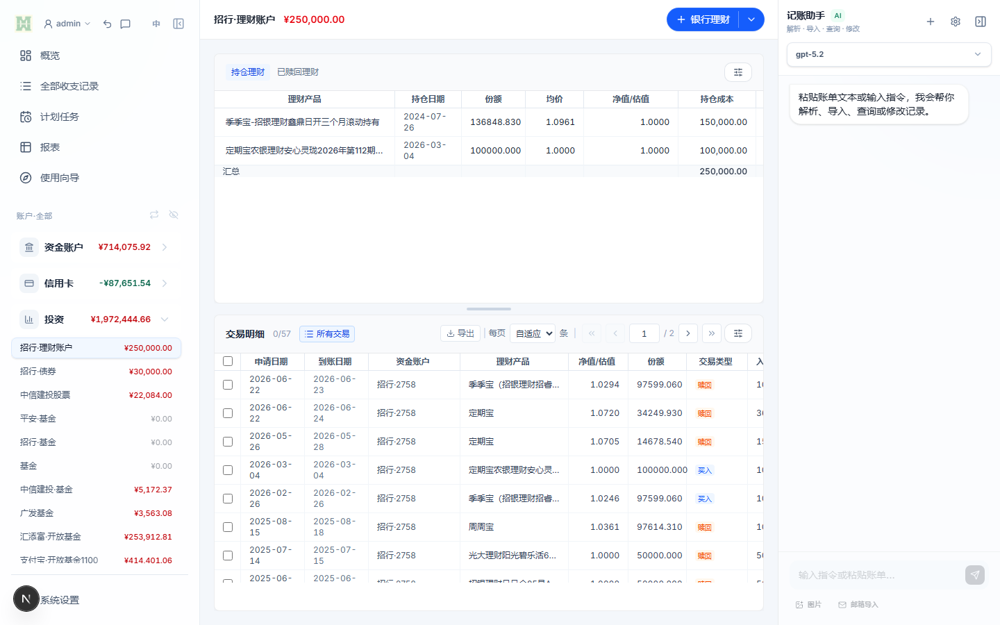

# MoneyMoneyHome（MMH）

  

  <a href="#中文">中文</a>
  ·
  <a href="#english">English</a>
  ·
  <a href="#日本語">日本語</a>

> 本地优先的家庭记账与全资产管理工作台：程序和账本数据都保存在你自己的 NAS、家庭服务器或本机环境里，不经过第三方云端。

## 中文

### 这是什么

MMH（MoneyMoneyHome）是一套面向家庭和个人的本地优先智能财务工作台。它把日常记账、信用卡账单、基金、股票、债券、存款、理财、房产、保险、贷款和往来款放进同一套账，让家庭的资产和负债有同一个长期稳定的视图。

它不是把家庭账本交给外部平台的 SaaS。它部署在自己的 NAS、家庭服务器或本机，敏感财务数据留在自己掌握的地方。

### 界面预览

  

|  |  |
| :---: | :---: |
| 登录与选账 | 基金持仓、交易明细与 AI 记账助手 |
|  |  |
| 债券：按存单管理持仓，付息自动落账 | 理财持仓与交易明细 |

### 快速开始

按你的情况选一条最短路径：

| 如果你是… | 这样做 |
| --- | --- |
| 飞牛 NAS 用户 | 打开 FN 软仓客户端搜索 MMH 安装，或从 [Releases](https://github.com/frankluise5220/MMH/releases) 下载 `.fpk` |
| 群晖 NAS 用户 | 从 [Releases](https://github.com/frankluise5220/MMH/releases) 下载 `.spk`，在套件中心手动安装 |
| Windows 电脑用户 | 下载 Windows 桌面版安装包，双击安装即可使用，数据保存在本机 |
| 有 Docker 的用户 | 使用预构建镜像 `ghcr.io/frankluise5220/mmh` 部署，日常更新直接拉取新镜像 |

首次打开有使用向导引导初始化账簿。完整步骤见 [NAS / 飞牛 fnOS / 群晖 DSM 安装与更新](deploy/nas-install-manual.md)。

### 它能帮你解决什么

- **一张表看清全部资产和负债**：资金、信用卡、投资、房产、保险、贷款统一到一个视图，不用再在多个 App 和表格之间来回看。
- **账单进来，账自动对好**：支付宝/微信 Excel、财智8、邮箱/PDF/截图 AI 识别，预览后批量导入，配合余额校准把记录与实际余额对齐。
- **周期的事不用反复记**：定投、还款、转账、缴费、存款取息、债券付息按计划自动入账。
- **债券按存单计息，付息自动到账**：城投债/国债以存单为单位管理，每期付息自动生成生息和取息流水，到期提醒，可核销。
- **贷款变化随时重算**：LPR 利率调整、提前还款（月供不变缩短期限 / 期限不变减少月供）自动重算还款计划。
- **AI 助手用聊天记账**：对话式记账、查账、批量修改、恢复误删，也可以直接把账单文本或截图丢给它。
- **多设备共用一本账**：Web、Windows 桌面端、Android App、开放 API 共享同一套数据和计算口径。

### 几个花了不少功夫的地方

这些不是"记个数"的表面功能，而是背后有一套自己的计算和落账逻辑：

- **债券按存单计息，付息自动到账**：城投债/国债以"存单"为单位管理——一笔买入就是一张存单，同一只债单可以有多张存单，各自的起息日、到期日、付息频率、票面利率都不同。每个付息日系统自动生成一对流水（生息 + 取息），到期只提醒、由你手工确认，支持提前赎回和核销；主条款只在债单上维护，每张存单又可以覆盖自己的条款。
- **贷款的 LPR 调整和提前还款重算**：房贷跟随 LPR 调息后自动重算后续月供和期数；提前还款时支持两种口径——"月供不变、缩短期限"会沿用之前的月供直到下一次调息，不把缩短后的结果倒灌进历史；"期限不变、减少月供"才按剩余本金和剩余期限重新均摊。还款计划怎么变，账本里的现金流就跟着怎么变。
- **账单进来，账自动对好**：支持支付宝/微信 Excel、财智8、邮箱/PDF/截图等多种来源导入，AI 识别后先预览再批量入账；再用余额校准把每一笔流水和实际账户余额对齐，不用自己加总。
- **周期的事全部自动落账**：定投、还款、转账、缴费、存款取息、债券付息都进同一个计划任务中心，到点自动生成流水，漏记、重复记、手动抄单这些坑在源头就绕开。
- **一家人共用一本账**：账户所有人和家庭成员是同一批人，一边改名另一边同步；支出可以选家庭成员、机构、往来对象，往来款的余额也能算清谁欠谁。

### 功能模块

| 模块 | 说明 |
| --- | --- |
| 概览 | 汇总资金、投资、固定资产、保险、负债等账户和关键指标。 |
| 日常记账 | 支出、收入、转账，以及代付、借入、借出、还款等往来款；支持多币种与汇率换算、二级收支分类、标签、机构、家庭成员和往来对象。 |
| 账户 | 管理现金、借记卡、电子钱包、存款、信用卡和各类投资账户，以及账户归属（家庭成员/所有人）。 |
| 信用卡 | 维护信用卡账户、账单周期、入账日期、交易明细、分期计划和还款记录。 |
| 投资基金 | 管理基金交易、净值缓存、持仓、份额、成本、收益和确认/到账规则，支持定投计划。 |
| 股票 | 管理股票账户、证券资金账户、买卖交易、分红、费用、收盘价和持仓盈亏。 |
| 债券 | 管理城投债、国债等债券：以存单为单位维护持仓，按存单计息，付息自动落账，到期提醒，支持核销。 |
| 存款 | 管理存款产品与存单，支持日均/月均计息、利息自动入账和取回。 |
| 理财与贵金属 | 维护理财产品和贵金属持仓。 |
| 固定资产 | 管理房产等固定资产、装修投入、资产估值、抵押关联和关联流水。 |
| 保险 | 维护保险产品、保单、投保记录、缴费计划、现金价值和续保。 |
| 贷款 | 管理房贷等贷款，支持还款计划、LPR 利率调整、提前还款（月供不变缩短期限 / 期限不变减少月供）和还款重算。 |
| 往来款 | 跟踪代付、借入、借出、还款和与往来对象相关的余额结果。 |
| 计划任务 | 管理定投、还款、转账、缴费、存款取息、债券付息等周期任务，自动入账。 |
| 报表与统计 | 收支统计、资产报表和余额校准对账，口径与账本明细一致。 |
| AI 识别与助手 | 从邮箱、文本、PDF、截图识别账单并批量导入；对话记账、查账、批量修改、恢复误删。 |
| 数据安全 | 流水附件、误操作撤销与删除恢复、手动/自动备份（可导出备份文件）。 |
| 多语言 | 界面支持中文、English、日本語。 |

### 部署与更新

| 运行方式 | 说明 |
| --- | --- |
| 飞牛 fnOS 原生 | 原生 `.fpk` 应用包，不依赖 Docker 和 PostgreSQL，数据保存在飞牛应用数据目录。 |
| 群晖 DSM 原生 | 原生 `.spk` 套件包，数据保存在群晖套件数据目录。 |
| Docker | 预构建镜像，适合 NAS / 家庭服务器；日常更新直接拉取新镜像，不在 NAS 上反复构建。 |
| Windows 桌面端 | 桌面应用内置本地 SQLite，打开即用，无需额外服务。 |

完整的安装、更新、备份与升级说明见 [NAS / 飞牛 fnOS / 群晖 DSM 安装与更新](deploy/nas-install-manual.md)。最新版本和安装包见 [GitHub Releases](https://github.com/frankluise5220/MMH/releases)。

### 常见问题

| 问题 | 回答 |
| --- | --- |
| 数据会上传到云端吗？ | 不会。账本数据保存在你自己的环境里；只有获取基金净值、股票行情等公开数据，以及你主动配置的邮箱导入、AI 服务才需要联网。 |
| 需要什么硬件？ | 飞牛/群晖原生包不依赖 Docker 和 PostgreSQL，低内存 NAS 也能运行；Docker 版需要能跑 Docker 的 NAS 或服务器。 |
| 不会命令行能用吗？ | 可以。飞牛/群晖装应用包、Windows 装桌面版都不需要命令行。 |
| 支持手机使用吗？ | 支持。手机浏览器可直接访问 Web 版，另有 Android App。 |
| 数据丢了怎么办？ | 支持手动/自动备份，可导出备份文件；误删的记录可以撤销，或从回收站恢复。 |
| 有多种安装方式，选哪个？ | 飞牛用户优先装 `.fpk`，群晖用户装 `.spk`，Windows 用户装桌面版，已有 Docker 环境的用镜像部署。 |

### 技术栈（给开发者）

- Web 端：Next.js + React + TypeScript + Prisma；Docker 版使用 PostgreSQL，飞牛/群晖/桌面版使用 SQLite。
- 客户端：响应式 Web、Windows 桌面端（Electron）、Android App；开放 API（`/api/v1`）供多端和第三方接入。
- 界面语言：中文、English、日本語，多端共享同一套业务口径。

### 安全模型

MMH 面向自托管环境，远程访问时需要注意明确的安全边界：

- 推荐通过 HTTPS 反向代理访问。
- 可用 `MMH_ALLOWED_HOSTS` 限定允许访问的域名或 IP。
- 登录会话 Cookie 使用 `HttpOnly`、`SameSite=Lax`，生产环境默认 `Secure`。
- 系统初始化、删除账簿等敏感操作会验证当前登录用户自己的密码。
- 数据库端口应只暴露给应用容器或本机网络；业务 API 会从当前会话解析账簿、用户和角色上下文，避免跨账簿访问。

### 参与与反馈

- 问题与建议：[GitHub Issues](https://github.com/frankluise5220/MMH/issues)
- 版本与安装包：[GitHub Releases](https://github.com/frankluise5220/MMH/releases)

## English

> English translation of the updated homepage is being prepared and will replace this placeholder.

## 日本語

> 更新後の日本語版は準備中です。このプレースホルダーはその際に置き換えられます。

## Developer Docs

Local developer guidance under `AGENTS.md`, `.skill/`, and `docs/` is intentionally ignored by Git in this workspace. Public documentation linked from this README should point only to tracked files, such as [NAS / 飞牛 fnOS / 群晖 DSM 安装与更新](deploy/nas-install-manual.md).
