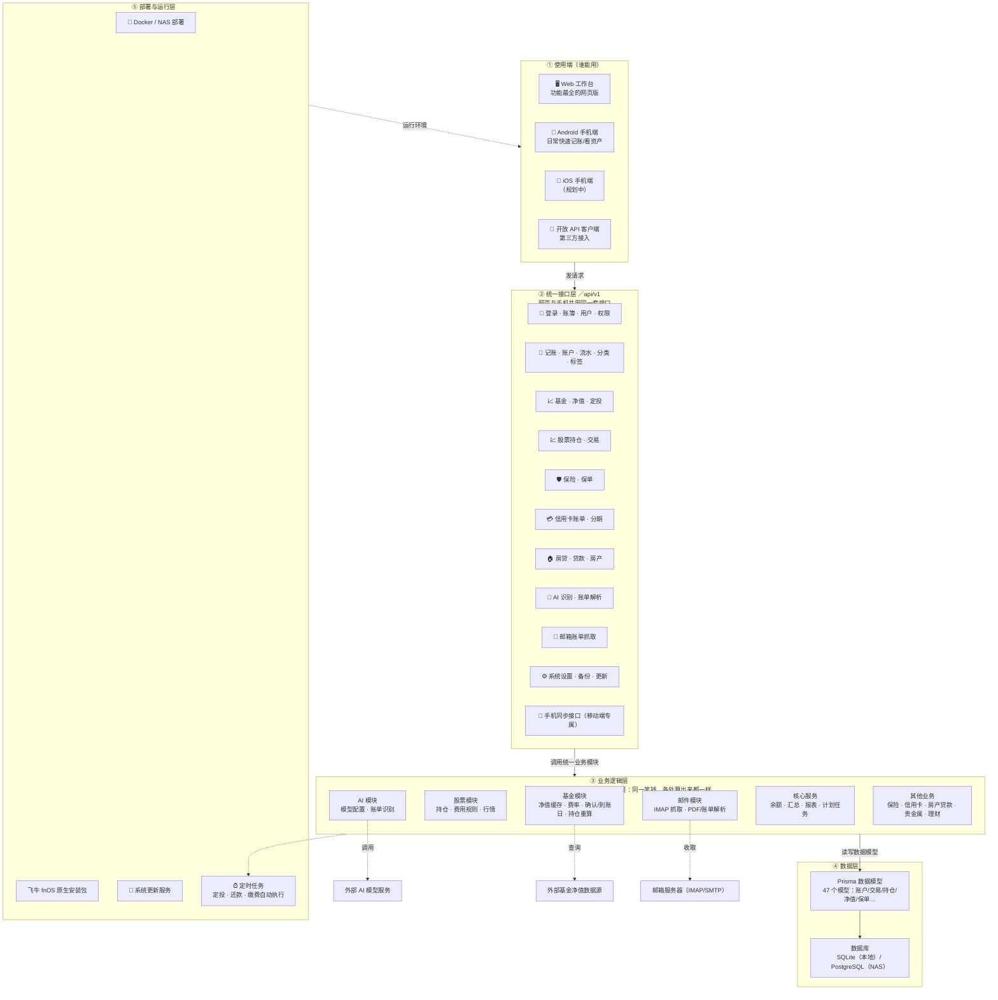
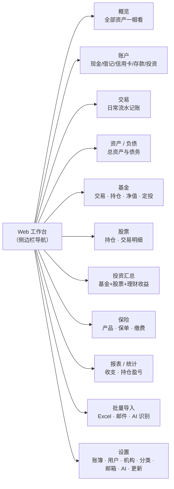
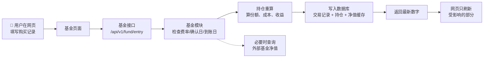

# MMH 系统架构总览

> 面向非开发者的阅读版架构说明。本文件是 `docs/development-docs.md` 文档地图的一部分。

## 一句话概括

MMH（MoneyMoneyHome）是一个**本地优先的家庭财务系统**：用户通过网页或手机 App 记账，系统负责把账户、流水、基金持仓、保险、房贷、信用卡等算清楚，所有数据都保存在自己的 NAS / 服务器上，不交给外部平台托管。

## 技术栈速览

| 部分 | 技术 |
| --- | --- |
| Web 工作台 | Next.js 16（App Router）+ React 19 + TypeScript + Tailwind CSS 4 |
| 数据访问 | Prisma ORM，支持 SQLite（本地/原生包）与 PostgreSQL（Docker/NAS） |
| AI 识别 | AI SDK（OpenAI 兼容模型） |
| 邮件账单 | imapflow / mailparser / nodemailer，支持 IMAP 抓取与 SMTP 发送 |
| 文件解析 | pdf-parse（PDF）、xlsx（Excel） |
| 图表 | recharts |
| 手机端 | Android 原生 App（`android/`）；iOS 规划中 |
| 部署 | Docker / NAS、飞牛 fnOS 原生包、内置系统更新服务 |

## 一、分层架构图（总览）

### 怎么看这张图（阅读说明）

- **从上往下看**：用户先接触「使用端」，请求进入「接口层」，接口不自己算账，而是交给「业务逻辑层」统一计算，最终读写「数据层」。
- **关键设计点**：网页和手机 App 走的是**同一套接口、同一套计算逻辑**，所以手机上看的总资产和网页上一定一致，不会出现"两个地方算出两个数"。
- **虚线是外部依赖**：AI 识别要调用外部 AI 服务、基金净值要查外部数据源、邮箱账单要连你的邮箱服务器。这些是只读/只进的外部连接，核心账本数据不出自己的服务器。

## 二、Web 工作台包含哪些功能页

## 三、一个具体例子：基金交易怎么流动

以「购买一笔基金」为例，看各层如何协作：

---

_维护说明：本图反映的是代码仓库的模块划分与数据流。每次重构涉及模块归属或数据流变化时，请同步更新本文件。_
